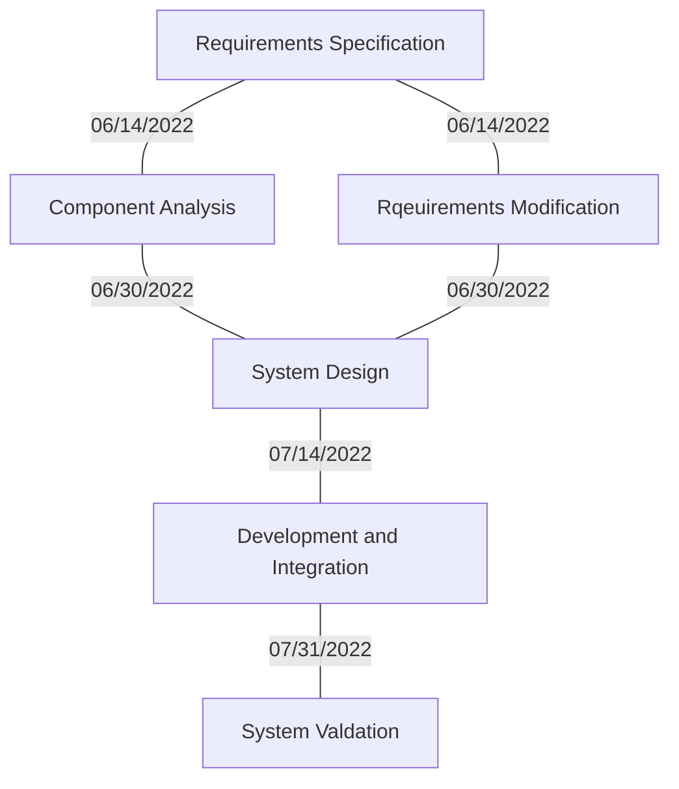

1.	Requirements Specification:
-- We need a scheduling system that can hold at least 100 students, 10 instructors, and 1 admin     

2.	Component Analysis
-- SQLite could be used to help with the project, and C++/Python to code the inferface

3.	Requirements Modification
-- Using SQLite to create the database of courses   <!-- Is there an existing schema to use or you have to make a new one? -Tam Ngo -->

4.	System Design
-- Here I would create the database

5.	Development and Integration
-- I would then integrate the database with the rest of my code (the classes and interface) and change functions to access information from the database

6.	System Validation 
-- Finally, run final tests and modify the code as needed
