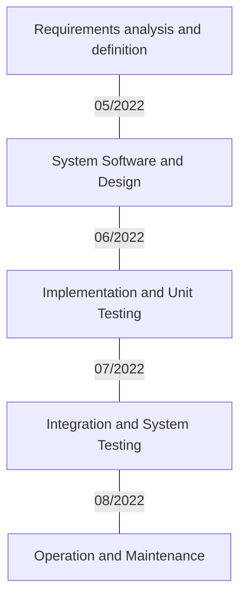

Waterfall:
 1.	Requirements analysis and definition:
     We need a scheduling system as well as a database of courses    
 2.	System Software and Design:
     Database of courses
     1 User Class and 3 subclasses – student, instructor, and admin
     Each class has their own specific commands and uses
 3.	Implementation and Unit Testing:
		   Code the database, and the rest of the interface
 4.	Integration and System Testing:
		   Integrate the database into the system and implement the functions for each class then run tests
 5.	Operation and Maintenance:
	  	 Run final tests, fix bugs, and make final updates

