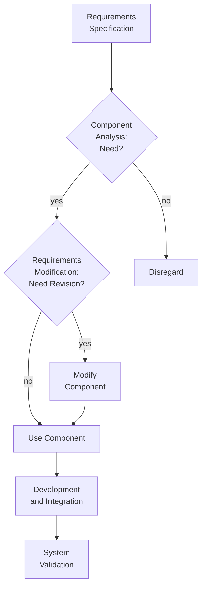

```mermaid
flowchart TD
    A[Requirements<br />Specification]--->B
    B{Component<br />Analysis:<br />Need?}-->|yes|C
    B-->|no|D
    C{Requirements<br />Modification:<br />Need Revision?}-->|yes|E
    D[Disregard]
    E[Modify<br />Component]
    C-->|no|F
    F[Use Component]
    E-->F
    F-->G[Development<br />and Integration]
    G-->H[System<br />Validation]
```
Requirement Specification:
  - "User" base class, derived "Student", "Instructor", and "Admin" classes
