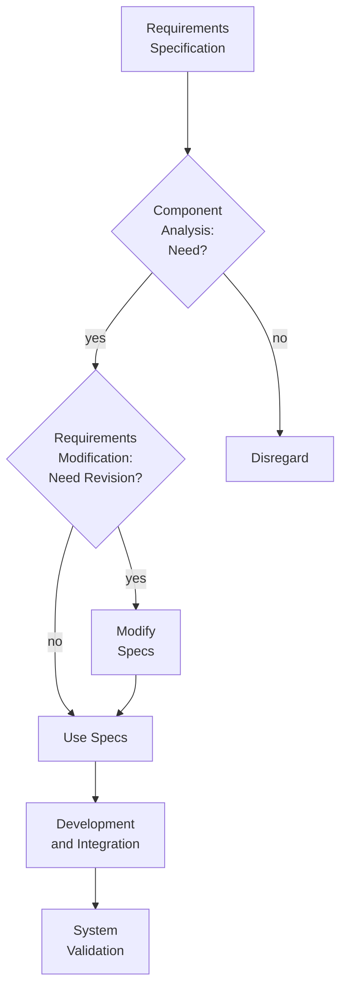

Requirement Specification:
  - "User" base class, derived "Student", "Instructor", and "Admin" classes in C++.
  - SQLite: databases for courses and users.
  - Unique functions for each role.

Component Analysis:
  - Most components aren't existing, they need to be created.

Requirement Modification:
  - Cannot modify specs.

System Design:
  - All newly create components.

Development and Integration:
  - Use newly developed components.

System Validation:
  - Bug fixes, user interface, testing.
<!-- This content will not appear in the rendered Markdown -->
