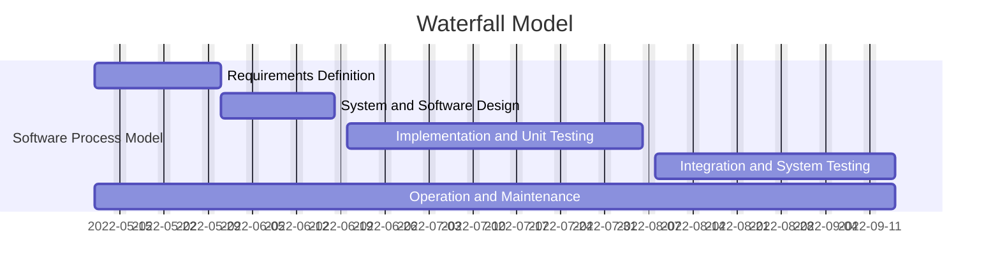

Requirements Definition:
  - Goals: Create a database of users and courses; different users with different roles perform different tasks unique to their roles.
  - Constraints: 
    + Create a system with users types: student, instructor, and admin.
    + Users should be able to do what their names suggest.
    + System should include multiple semesters, print-out of schedule, and scheduling preferences.

System and Software Design:
  - Use C++ and its Object-Oriented Programming capabilities, along with SQLite for database management.
  - Derived classes "Student", "Instructor", and "Admin" will inherit from a "User" base class, each with their unique roles and tasks.
  - An SQL schema for both courses, and users.

Inplementation and System Testing:
  - C++: Base class -> Derived classes -> Functions -> User Interface
  - SQLite: Schema

Integration and System Testing:
  - C++: Main function where classes and functions interact.
  - Communication with database.

Operation and Maintenance: 
  - Create executable, test, and bug fix, and update executable.
