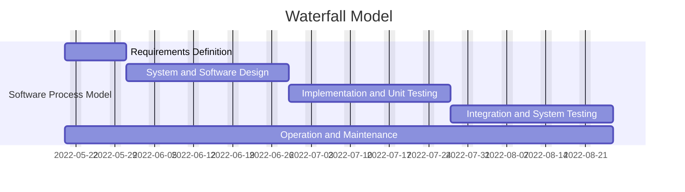

Requirements Definition:
  - Goals: Create a database of users and courses; different users with different roles perform different tasks unique to their roles.
  - Constraints: 
    + Create a system with users types: student, instructor, and admin.
    + Users should be able to do what their names suggest.
    + System should include multiple semesters, print-out of schedule, and scheduling preferences.
System and Software Design:
  - 
